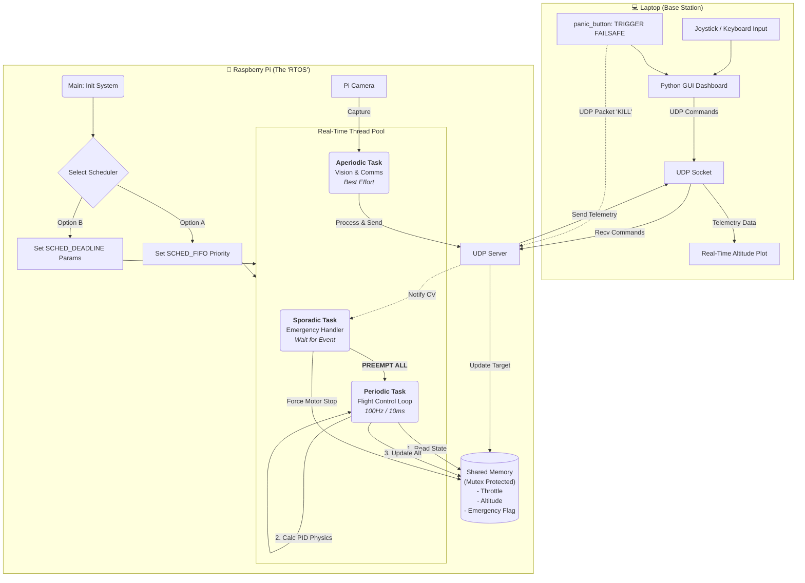

Here is the **Master Project Flowchart** summarizing our architecture, the hardware interactions, and the scheduling logic we have designed.

### 1\. The System Architecture Flow (Mermaid)

This flowchart represents the **Run-Time Logic** of the system we are about to build. It visualizes how the Raspberry Pi (Drone) handles concurrent tasks and interacts with the Laptop (Base Station).

-----

### 2\. Task Summary Table

This table summarizes the specific roles and attributes we will implement in the C++ code.

| Task Name | Task Type | RTOS Priority (RM) | Deadline Behavior (EDF) | Function |
| :--- | :--- | :--- | :--- | :--- |
| **Emergency** | **Sporadic** | **Critical (90)** | N/A (Event Driven) | Sleeps until `cv.notify()`. When triggered, preempts *everything* to stop motors. |
| **Flight Control** | **Periodic** | **High (50)** | Runtime: 2ms Period: 10ms | Runs the Physics Simulator ($F=ma$) and PID math. Must not jitter. |
| **Vision/Comms** | **Aperiodic** | **Low (20)** | Runtime: 15ms Period: 33ms | Captures Pi Camera frames, simulates processing load, sends UDP telemetry. |

-----

### 3\. Implementation Roadmap

Here is the step-by-step plan for our coding phase, which we can start next.

#### Phase 1: The Foundation (Skeleton)

  * [ ] **Setup:** Install `libopencv-dev` on Pi.
  * [ ] **Code:** Create `main.cpp` with the `SharedState` struct and Mutex locks.
  * [ ] **Code:** Implement the 3 basic threads with standard `std::thread` (no real-time scheduling yet).
  * [ ] **Test:** Ensure threads run without crashing/deadlocking.

#### Phase 2: The "Real-Time" Injection

  * [ ] **Code:** Implement `pthread_setschedparam` to apply `SCHED_FIFO` (Rate Monotonic).
  * [ ] **Verification:** Use the Linux `htop` command to verify thread priorities.
  * [ ] **Experiment:** Implement the `SCHED_DEADLINE` (EDF) syscall wrapper.

#### Phase 3: The Base Station & Integration

  * [ ] **Python:** Write `gcs.py` using `matplotlib` (for graphs) and `socket`.
  * [ ] **Integration:** Connect Laptop and Pi via WiFi.
  * [ ] **Sim:** Send Joystick data -\> Pi calculates Physics -\> Pi sends Altitude back -\> Python plots it.

#### Phase 4: The "Stress Test" (The Demo)

  * [ ] **Action:** Add "heavy math" to the Vision thread to choke the CPU.
  * [ ] **Observation:** Watch the Python graph.
      * **Result A:** Altitude line stays smooth (RTOS working).
      * **Result B:** Camera video/telemetry lags (Lower priority starving).
  * [ ] **Final Test:** Hit the "Emergency" button on Laptop and verify sub-millisecond shutdown.

-----

### Next Step: Implementation

We are ready to write code. Since the **Base Station (Python)** is the interface we need to see what's happening, shall we start by writing the **Python GCS Script**?

(Or if you prefer, we can start with the **C++ Drone Core**). Which one do you want first?